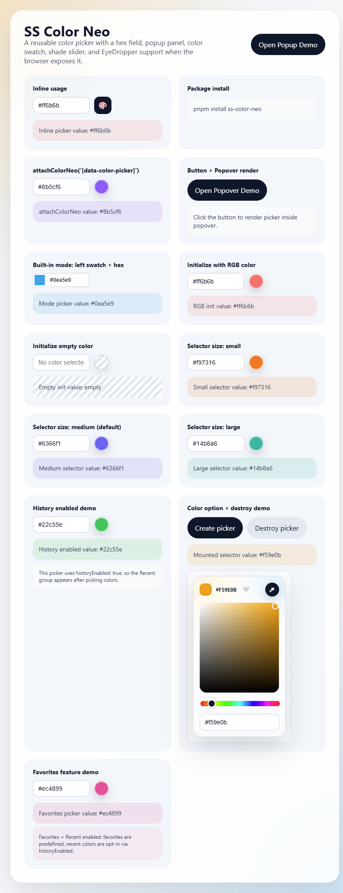
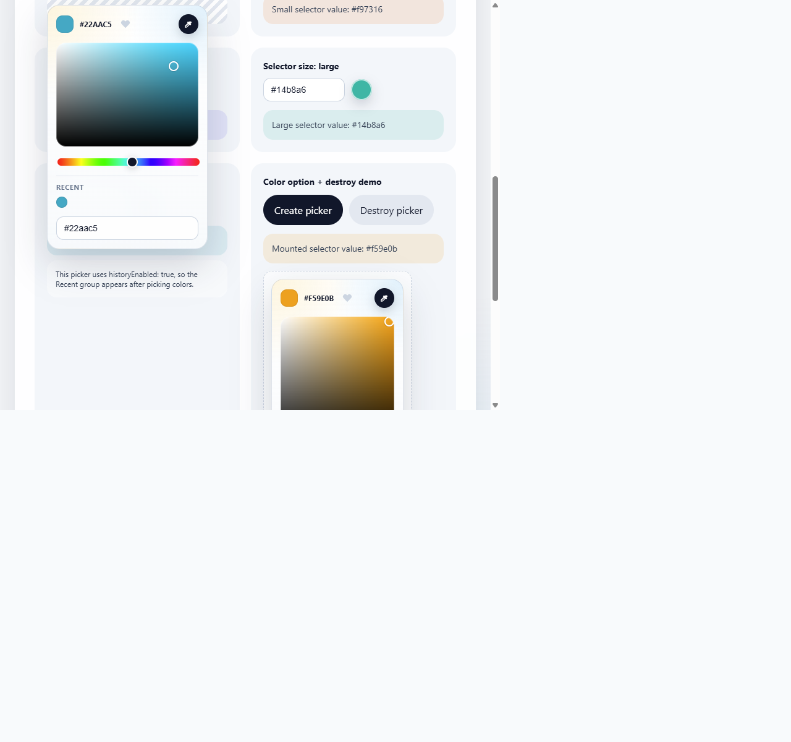

# SS Color Neo

SS Color Neo is a reusable JavaScript color picker inspired by tools like Coloris. It ships with:

- a hex color input
- a popup-friendly picker panel
- a 2D color swatch for saturation and brightness
- a hue slider to move from one shade family to another
- EyeDropper support when the browser exposes the API
- direct mount mode inside any parent element (no visible input required)
- built-in UI mode with a left swatch + hex input
- favorites with toggle support and change callback
- optional recent-history tracking (off by default)

## Screenshots

### Demo overview



### Grouped sections (Favorites and Recent)



## Install

```bash
pnpm install ss-color-neo
```

If npm registry access is unavailable, install directly from GitHub:

```bash
pnpm add github:<owner>/ss-color-neo#<tag-or-commit>
```

Example:

```bash
pnpm add github:your-org/ss-color-neo#v0.1.0
```

You can also put it directly in `package.json`:

```json
{
  "dependencies": {
    "ss-color-neo": "github:your-org/ss-color-neo#v0.1.0"
  }
}
```

For GitHub installs, keep `dist/` committed in this repo so consumers can use the package without publishing to npm.

## Use in another project

```ts
import { ColorNeo } from 'ss-color-neo';

const input = document.querySelector('#brand-color');

if (input instanceof HTMLInputElement) {
  new ColorNeo(input, {
    color: '#ff6b6b',
    onChange: (hex) => {
      console.log('Selected color:', hex);
    }
  });
}
```

### Built-in mode: left swatch + hex input

```ts
import { ColorNeo } from 'ss-color-neo';

const input = document.querySelector('#brand-color');

if (input instanceof HTMLInputElement) {
  new ColorNeo(input, {
    mode: 'hex-swatch-left',
    color: '#0ea5e9'
  });
}
```

### Mount directly into a parent element

Use this when you want to render the full selector inside a container and not rely on a visible input.

```ts
import { mountColorNeo } from 'ss-color-neo';

const picker = mountColorNeo('#picker-slot', {
  color: '#22c55e',
  onChange: (hex) => {
    console.log('Mounted picker color:', hex);
  }
});
```

### Selector size options

`size` controls the picker panel dimensions and supports `small`, `medium`, and `large`.

- `medium` is the default when `size` is omitted.
- In parent mount mode (`mountColorNeo`), selector width is capped to the parent container width.

```ts
import { ColorNeo } from 'ss-color-neo';

const input = document.querySelector('#brand-color');

if (input instanceof HTMLInputElement) {
  new ColorNeo(input, { size: 'small' });
  new ColorNeo(input, { size: 'medium' });
  new ColorNeo(input, { size: 'large' });
}
```

### Open below a custom anchor element

```ts
import { ColorNeo } from 'ss-color-neo';

const input = document.querySelector('#brand-color');
const iconButton = document.querySelector('#open-color');

if (input instanceof HTMLInputElement && iconButton instanceof HTMLElement) {
  const picker = new ColorNeo(input);
  iconButton.addEventListener('click', () => picker.open(iconButton));
}
```

You can also attach it to many inputs:

```ts
import { attachColorNeo } from 'ss-color-neo';

attachColorNeo('[data-color-picker]');
```

This selector-based usage is also included in the demo page as a dedicated example.

## Options

```ts
type ColorNeoOptions = {
  color?: string;
  closeOnSelect?: boolean;
  mode?: 'default' | 'hex-swatch-left';
  historyEnabled?: boolean;
  size?: 'small' | 'medium' | 'large';
  historyStorageKey?: string;
  onChange?: (hex: string) => void;
  favorites?: string[] | string;
  onFavoritesChange?: (favorites: string[]) => void;
};
```

### Destroy a picker

Each picker instance exposes `destroy()`.

```ts
const picker = new ColorNeo('#brand-color', {
  color: '#ff6b6b'
});

picker.destroy();
```

You can also use the exported helper when you want explicit cleanup for one or many instances.

```ts
import { attachColorNeo, destroyColorNeo } from 'ss-color-neo';

const pickers = attachColorNeo('[data-color-picker]', {
  color: '#8b5cf6'
});

destroyColorNeo(pickers);
```

### Favorites

Favorites can be initialized as either:

- an array of hex values
- a comma-separated string of hex values

The picker shows a heart button to add/remove the current color from favorites.

Use `onFavoritesChange` to react to updates:

```ts
new ColorNeo('#brand-color', {
  favorites: ['#ff6b6b', '#fbbf24', '#4ade80'],
  onFavoritesChange: (favorites) => {
    console.log('Favorites:', favorites);
  }
});
```

### Recent color history (LIFO, opt-in)

Every new selected color is saved to `localStorage` in LIFO order (newest first), de-duplicated, and shown as clickable swatches in the picker popup.

- history is disabled by default
- enable it with `historyEnabled: true`
- default storage key: `color-neo-history`
- configure per picker with `historyStorageKey`

```ts
new ColorNeo('#brand-color', {
  historyEnabled: true,
  historyStorageKey: 'brand-color-history'
});
```

## Local development

```bash
pnpm install
pnpm dev
```

The demo page opens at the Vite dev URL and includes both inline usage and a picker rendered inside an HTML dialog popup.

Current demo coverage:

- inline usage opened from a custom icon button
- selector-based initialization with `attachColorNeo('[data-color-picker]')`
- popup usage inside an HTML dialog
- picker rendered inside a popover
- built-in `hex-swatch-left` mode
- selector size demos: `small`, `medium`, and `large`
- dedicated history-enabled demo with separate `Recent` section
- favorites demo with grouped `Favorites` + `Recent` sections
- direct parent-element mounting with `mountColorNeo`
- initialization with the `color` option
- explicit destroy flow with `destroy()` and `destroyColorNeo(...)`

## Automated checks

```bash
pnpm typecheck
pnpm test
pnpm build
```

A GitHub Actions workflow is included in `.github/workflows/ci.yml` to run the same checks on pushes and pull requests.